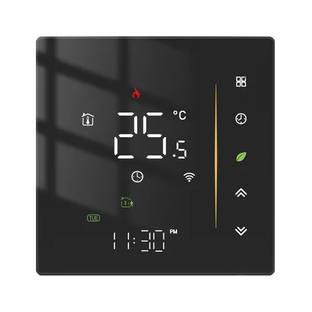
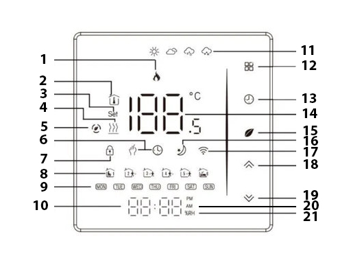

# tuya_thermostat_full_custom_r02_zrd

Пользовательское руководство к прошивке Zigbee-термостата (модель TZE204
`edl8pz1k`). Термостат состоит из двух модулей: дисплейного, который непосредственно
управляет экраном, клавишами и реле нагрева, и Zigbee-модуля, который общается с
умной сетью (хабом). Данное руководство описывает поведение устройства с точки
зрения пользователя.

Возможности:

- измерение температуры внутренним и внешним датчиками (два NTC);
- управление нагревом с гистерезисом и выбором датчика (IN / OU / AL);
- недельное расписание: 7 дней × 6 переходов;
- меню настроек из 10 пунктов, калибровка датчиков, лимиты заданной температуры;
- установка часов и формата времени, синхронизация из сети;
- блокировка клавиш, индикация состояния, дневная/ночная яркость;
- обновление прошивки по воздуху (через Zigbee-хаб).

---

## 1. Дисплей

### Обычный режим (термостат включён)

Номера в таблице соответствуют указателям на рисунке выше.

| № | Описание |
|---|---|
| 1 | идёт нагрев (реле включено) |
| 2 | показывается измеренная температура (гаснет, пока на экране заданная температура или настройка) |
| 3 | показывается заданная температура или значение настройки, а не измеренная температура (окно живёт 7 секунд) |
| 4 | подключён и исправен **внешний (выносной) датчик**: он даёт показания в рабочем диапазоне. При обрыве, коротком замыкании или температуре вне предела символ **гаснет** (состояние датчика проверяется раз в секунду) |
| 5 | не используется прошивкой (сегмент есть на панели, но не используется) |
| 6 | индикатор режима управления: **ручной** ↔ **от расписания** |
| 7 | включена блокировка клавиш |
| 8 | слоты недельного расписания (в меню подсвечивают редактируемый слот) |
| 9 | текущий день недели (в меню — редактируемый день) |
| 10 | часы (HH:MM), двоеточие мигает раз в секунду; формат 24ч или AM/PM |
| 11 | погодные иконки: горит только **солнце** — пока беспроводной датчик климата жив (облако, дождь и снег прошивкой не используются) |
| 12 | сенсорная клавиша **«Меню»** |
| 13 | сенсорная клавиша **«Часы»** |
| 14 | температура выбранного датчика (шаг 0.5 °C, знак «−» для отрицательных температур - есть ограничение по выводу) |
| 15 | сенсорная клавиша **питания** |
| 16 | не используется |
| 17 | термостат подключён к Zigbee-сети (горит постоянно, когда в сети, мигает при подключении к сети) |
| 18 | сенсорная клавиша **«↑»** |
| 19 | сенсорная клавиша **«↓»** |
| 20 | индикатор AM/PM-24h формата часов |
| 21 | окно влажности беспроводного датчика - появляется на 3 секунды после короткого клика по клавише питания |

### Специальные значения на больших цифрах

- **`Er`** — выбранный датчик неисправен или отсутствует. В режиме AL ошибка
  показывается, если нерабочим оказался хотя бы один из двух датчиков.
  Символ **«Нагрев»** при этом отражает только **внешний** датчик и гаснет при
  его обрыве/коротком замыкании/температуре вне предела независимо от режима
  IN/OU/AL (например, в режиме IN при отсутствии внешнего датчика `Er` не
  показывается, но и символ «Нагрев» не горит).
- **`Lo`** — температура ниже нижнего предела отображения;
  **`UP`** — выше верхнего.
- **`Set`** — показывается заданная температура (а не измеренная). Окно живёт
  **7 секунд**, затем на экран возвращается измеренная температура. То же
  самое окно появляется, когда настройка пришла из сети. Исключение —
  переключение режима ручной/расписание из сети: окно не показывается,
  просто меняются иконки «рука» и «часы».
- **`UP` перед обновлением** — идёт обновление прошивки (см. раздел 8).

### Беспроводной датчик климата (WS)

Устройство принимает показания привязанного беспроводного датчика
температуры и влажности (по Zigbee-репортам, обычно раз в 5 минут) и
использует их так:

- **пока температура приходила не позднее 5 минут назад**: большие цифры
  показывают температуру WS, и **реле управляется по ней** — независимо от
  режима IN/OU/AL в настройках;
- **если прошло больше 5 минут** (датчик разрядился/пропал из сети) или
  температура ещё ни разу не приходила: термостат мгновенно возвращается к
  датчику из настроек (IN/OU/AL, показания и `Er` — как обычно), а значения
  WS считаются недействительными;
- **аварийная отсечка по перегреву** (максимальный предел + запас) работает
  только по **проводным** датчикам — беспроводной в ней не участвует;
- **влажность** WS в управлении не участвует; посмотреть её можно **быстрым
  кликом по «питанию»** (термостат включён): на больших цифрах появляется
  значение влажности с иконкой **`%RH`** на **3 секунды**, затем экран
  возвращается к температуре. Значение — **целые проценты** (округляется,
  100 % показывается как 99).
  Если WS не свежий — вместо числа `--`. В выключенном состоянии клик ничего
  не делает.
- **«Солнышко»** (пиктограмма «солнце» на индикаторе) горит при включённом
  термостате, пока WS свежий (т.е. пока он реально управляет термостатом),
  и гаснет, когда датчик протух или температура от него ещё ни разу не
  приходила.

### При подачи питания

1. ~3 секунды — включены все символы дисплея и все подсветки (самопроверка);
2. ~2 секунды — гаснет всё, кроме номера версии прошивки на больших цифрах
   (например, версия 1.02 отображается как «102»);
3. дисплей гаснет, устройство остаётся выключенным (горит только зелёный
   листочек). Часы при этом показывают 00:00 до синхронизации со сетью.

---

## 2. Управление

Клавиши сенсорные: **питание («листочек»)**, **«Меню»**, **«Часы»**,
**«↑»**, **«↓»**.

| Жест | Как делать |
|---|---|
| Короткое нажатие | нажать и быстро отпустить (до 0.5 с) |
| Удержание | держать; действие срабатывает через указанные в таблице время |
| Автоповтор | при удержании стрелок повтор каждые ~60 мс |

### Термостат выключен

| Клавиша | Жест | Действие |
|---|---|---|
| Питание | удержание **1.2 с** | включить (короткий клик ничего не делает) |
| «↓» | удержание **2.0 с** | подключение к сети: знак «сеть» начинает мигать, устройство инициирует подключение к Zigbee-сети (если «↓» нажат один) |
| «↑» + «↓» | удержание **2.0 с** | переключить режим блокировки клавиш |
| Остальные | — | не действуют |

### Термостат включён

| Клавиша | Жест | Действие |
|---|---|---|
| Питание | удержание **1.2 с** | выключить |
| «Меню» | короткое нажатие | переключить режим: **ручной ↔ от расписания** |
| «Меню» | удержание **3.0 с** | войти в меню настроек |
| «Часы» | короткое нажатие | переключить формат часов: 24 ч ↔ AM/PM |
| «Часы» | удержание **3.0 с** | войти в настройку часов |
| «↑» / «↓» | клик или удержание | изменить заданную температуру шагом 0.5 °C (**только в ручном режиме**); на экране загорается `Set`, значение показывается 7 с |
| «↑» + «↓» | удержание **2.0 с** | переключить режим блокировки клавиш |

> В режиме «от расписания» стрелки заданную температуру не меняют — её
> задаёт расписание.

---

## 3. Режимы и настройка

### Включение и выключение

При подаче питания устройство всегда стартует **выключенным**. Переключение —
только удержанием клавиши питания 1.2 с.

Выключенный термостат продолжает измерять температуру и сообщать её в сеть —
просто он не греет и экран погашен. Нагрев всегда выключен, когда термостат
выключен или идёт обновление прошивки.

### Ручной режим и расписание

- **Ручной режим** (иконка «рука»): заданную температуру меняют стрелками или
  из сети.
- **Режим от расписания** (иконка «часы»): действует недельное расписание,
  заданная температура автоматически меняется по его переходам. Стрелки в
  этом режиме её не меняют.
- Переключение — короткое нажатие «Меню». Переключение не очищает расписание.
  Режим можно переключить и из сети — иконки «рука»/«часы» меняются сразу,
  без окна настройки.

### Установка часов

1. При включённом термостате удержать **«Часы» 3.0 с**.
2. По очереди мигают и настраиваются: **день недели → часы → минуты**.
   Стрелки листают значения с упором (день 1…7, часы 0…23, минуты 0…59).
3. Нажатие «Часы» — переход к следующему шагу; на последнем шаге время
   применяется и открывается редактор расписания.
4. Выход — клавиша питания или «Меню» (время сохраняется), либо **20 секунд
   без нажатий** — автовыход с сохранением.

Часы могут синхронизироваться из сети после подключения; без синхронизации они
идут с 00:00.

### Недельное расписание (7 дней × 6 слотов)

1. При входе (после установки часов или удержанием «Часы» 3 с и дальнейшей
   навигацией) отображается **хаб выбора дня**: горит только мигающая иконка
   дня недели. Стрелки выбирают день (Пн…Вс), «Часы» — вход в этот день.
2. Внутри дня настраиваются **6 слотов (SP1…SP6)**: время и температура.
   Нажатие «Часы» ведёт по полям: **часы → минуты → температура → следующий
   слот → следующий день**. Редактируемое поле мигает; слот и день видны по
   иконкам.
3. После 6-го слота день сохраняется и возврат в хаб со **следующим днём**
   (дни можно перепрыгивать стрелками). После воскресенья редактор закрывается.
4. Выход — клавиша питания или «Меню»: текущий слот и день сохраняются.
   **Нетронутые слоты остаются пустыми** — можно заполнить меньше шести слотов
   в день. Либо **20 секунд без нажатий** — автовыход с сохранением (в хабе
   выбора дня — просто выход).

### Меню настроек

Вход: удержание **«Меню» 3.0 с** при включённом термостате. Номер пункта
(01…10) выводится на малых цифрах, значение — на больших.

| № | Пункт | Диапазон, шаг | Назначение |
|---|---|---|---|
| 01 | Калибровка внутреннего датчика | −9.0 … +9.0, 0.5 | поправка показаний внутреннего датчика |
| 02 | Калибровка внешнего датчика | −9.0 … +9.0, 0.5 | поправка показаний внешнего датчика |
| 03 | Гистерезис | 0.5 … 2.5, 0.5 | ширина полосы включения/выключения нагрева |
| 04 | Режим блокировки кнопок | 1 … 2 | какой режим включает аккорд «↑»+«↓»: 1 — всё, кроме питания; 2 — всё запрещено |
| 05 | Датчик | IN / OU / AL | какой датчик показывает температуру и управляет нагревом |
| 06 | Минимальная заданная температура | 5.0 … 15.0, 0.5 | нижняя граница заданной температуры |
| 07 | Максимальная заданная температура | 20.0 … 45.0, 0.5 | верхняя граница заданной температуры |
| 08 | Яркость день (06:00–22:00) | 0 … 8 | уровень яркости днём (0 — всё погашено) |
| 09 | Яркость ночь (22:00–06:00) | 0 … 8 | уровень яркости ночью |
| 10 | Сброс к заводским | 0 / 1 | при значении 1 — полный сброс настроек и расписания; после сброса пункт снова 0 |

Навигация в меню: **«Меню»** — следующий пункт (предыдущий сохраняется),
**стрелки** — правка значения, **«Часы» или клавиша питания** — сохранить и
выйти (термостат НЕ выключается), **20 секунд без нажатий** — автовыход с
сохранением.

Лимиты пунктов 06/07 задаются независимо друг от друга и не зависят от текущей
заданной температуры: минимальная строго 5…15, максимальная строго 20…45.

### Блокировка клавиш

- Включение/выключение — аккорд **«↑» + «↓», удержание 2.0 с**, в любом
  порядке нажатия и в любом состоянии питания. Это единственный способ
  разблокировать клавиши с самого устройства.
- В выключенном состоянии одиночное удержание **«↓» 2.0 с** по-прежнему
  запускает подключение к сети: если нажаты обе стрелки — срабатывает
  блокировка, сеть стартует только от «↓», нажатого одного.
- Режим при включении берётся из **меню, пункт 04**:
  - **1 — «всё, кроме питания»**: работает только клавиша питания;
  - **2 — «всё запрещено»**: не работает ничего, кроме аккорда.
- Если режим **2** включён, пока открыты меню настроек, настройка часов или
  расписание — этот режим **сразу закрывается** (с сохранением, как при
  выходе клавишей питания), потому что управлять им больше нечем.
- Индикация: при включённом термостате замок горит постоянно; при выключенном
  (тёмный экран) после смены блокировки замок кратко мигает ~5 раз (~3 с).
  При включённой блокировке в **выключенном** состоянии знак **замок горит постоянно**
  рядом с зелёным листиком — на яркости из настроек (день/ночь); при снятии блокировки
  он гаснет, при яркости 0 гаснет всё.
- Блокировку можно менять и из сети — индикация та же.

---

## 4. Как греет термостат

- **Гистерезис симметричный, ± вокруг заданной температуры**: нагрев
  включается, когда температура опустилась до «заданная − гистерезис», и
  выключается, когда поднялась до «заданная + гистерезис». Пример: заданная
  температура 20.0, гистерезис 1.0 → включается ниже 19.0, выключается выше
  21.0.
- **Минимальное время выключенного состояния — 30 секунд.** После любого
  выключения реле следующее включение возможно не раньше, чем через 30 с
  (защита от слишком частых пусков). Как только это время истекло, включение
  происходит сразу при выполнении условия. Выключение всегда происходит
  сразу же. Сразу после включения питания первая задержка не действует.
- **Датчик (пункт меню 05):**
  - **IN** — только внутренний датчик; при его отказе нагрев выключается;
  - **OU** — только внешний; если внешний датчик отсутствует или оборван,
    нагрев не включается вообще (переключения на внутренний нет);
  - **AL** — работают оба датчика: включение только когда **оба** холодны,
    выключение — когда **хотя бы один** тёплый. Если один из пары отказал,
    нагрев ведётся по оставшемуся рабочему датчику, но на экране показывается
    `Er`. Если отказали оба — нагрев выключен.
- **Лимиты заданной температуры** (пункты 06/07) ограничивают диапазон, в
  котором стрелки и редактор расписания могут менять заданную температуру.
  Записанное в расписание значение хранится как есть (в пределах допустимого),
  но **при работе** термостат использует его внутри лимитов: если слот ниже
  min — греет до min, если выше max — до max. То же касается и заданной
  температуры в ручном режиме: если значение вне лимитов (например, пришло
  из сети до того, как лимиты изменили), нагрев всё равно удерживается внутри
  лимитов. Изменение лимитов сразу меняет поведение, не переписывая
  расписание (слот возвращается к исходному значению, когда лимиты
  возвращаются).
- Пока термостат выключен или обновляется, нагрев принудительно выключен.

---

## 5. Яркость

- Уровни 0…8 (0 — дисплей и подсветка полностью погашены), отдельно для дня
  (06:00–22:00) и ночи (22:00–06:00) — пункты меню 08 и 09.
- При включённом термостате любое нажатие клавиши поднимает яркость на
  максимум на 20 секунд, затем возвращается к дневному/ночному уровню.
- При выключенном: сразу после выключения ~7 секунд подсвечиваются клавиши и
  зелёный листочек на максимуме, затем остаётся только зелёный листочек на
  дневном/ночном уровне.

---

## 6. Измеренная и заданная температура на экране

- В обычном режиме большие цифры показывают измеренную температуру; домик с
  термометром подтверждает, что это именно измерение.
- Нажатие стрелки (ручной режим) или приход настройки из сети показывает
  заданную температуру (значение) с иконкой `Set` на 7 секунд, затем
  возвращается измеренная температура.
- Отображаемый диапазон: от −9.99 до +99.99 °C; за его пределами — `Lo`/`UP`,
  при неисправном датчике — `Er`.

---

## 7. Сеть (Zigbee)

- Иконка «сеть» горит постоянно, когда устройство подключено к сети.
- **Подключение к сети:** при выключенном термостате удержать **«↓» 2.0 с** —
  знак «сеть» начинает мигать (~1.5 минуты), устройство инициирует
  подключение к Zigbee-сети. Мигание прекращается автоматически по истечении
  времени или раньше, когда подключение подтверждено.
- Настройки, изменённые на устройстве, передаются в сеть; настройки из сети
  применяются к термостату (и показываются окном `Set`, если термостат
  включён; переключение режима ручной/расписание окно не показывает — сразу
  меняются иконки).

---

## 8. Обновление прошивки

Обновление запускается из Zigbee-хаба и занимает некоторое время:

1. на больших цифрах появляется **`UP`** (дисплей и подсветка на максимуме),
   нагрев на это время выключен;
2. при успехе кратко показывается **`AL`** (порядка 2 секунд), затем устройство
   перезагружается с новой версией;
3. при сбое передачи показывается **`Er`** — обновление нужно запустить заново.

Если версии совпадают, обновление не запускается.

---

## 9. Статус

Прошивка активно разрабатывается. Часть функций ещё не проверена на
реальном устройстве; возможны расхождения описания с фактическим поведением.
